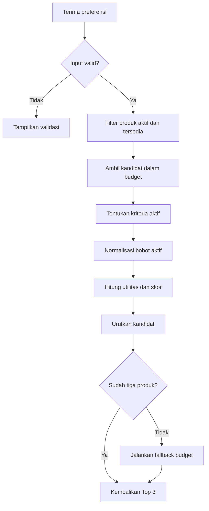

# Rancangan Perubahan Perhitungan SMART Advisor Clementine

| Metadata | Keterangan |
|---|---|
| Dokumen | Rancangan perubahan algoritma SMART Advisor |
| Proyek | Clementine |
| Versi | 1.0.0 |
| Status | Usulan rancangan |
| Ruang lingkup | Rekomendasi produk jam tangan untuk konsumen |

## 1. Ringkasan Perubahan

Smart Advisor tetap menggunakan metode *Simple Multi-Attribute Rating Technique* (SMART). Namun, model lama perlu diperbaiki agar skor benar-benar menunjukkan kecocokan preferensi konsumen. Perubahan utama mencakup pemisahan filter kelayakan dari kriteria SMART. Selain itu, kriteria kosong tidak lagi memperoleh nilai utilitas otomatis.

Keputusan rancangan yang digunakan adalah sebagai berikut:

1. Stok dihapus dari kriteria SMART dan dijadikan filter kelayakan.
2. Smart Advisor menggunakan lima kriteria preferensi konsumen.
3. Budget dinilai sebagai kecocokan terhadap batas anggaran pengguna.
4. Kriteria yang tidak dipilih dikeluarkan dari perhitungan.
5. Bobot kriteria aktif dinormalisasi ulang secara dinamis.
6. Skor akhir ditampilkan dalam rentang 0 sampai 100.
7. Fallback dijalankan setelah pemeringkatan, bukan sebagai bagian SMART.
8. Best seller hanya digunakan sebagai pemecah skor seri.

## 2. Masalah pada Model Lama

### 2.1 Stok memengaruhi kecocokan konsumen

Model lama memberi bobot lima persen kepada jumlah stok. Semakin banyak stok, semakin tinggi skor rekomendasi produk. Padahal, jumlah stok tidak menunjukkan kecocokan terhadap kebutuhan konsumen. Pengguna hanya memerlukan kepastian bahwa produk masih dapat dibeli.

### 2.2 Preferensi kosong memperoleh utilitas satu

Model lama menetapkan utilitas satu ketika preferensi tidak dipilih. Ketentuan tersebut menambahkan skor kepada semua alternatif secara otomatis. Jika empat preferensi kategorikal kosong, setiap produk memperoleh skor dasar 0,65. Akibatnya, batas fallback 0,30 tidak mungkin tercapai.

### 2.3 Tujuan fungsi harga tidak konsisten

Model lama menyebut harga sebagai kriteria *cost*. Namun, penjelasannya juga memprioritaskan harga yang mendekati budget dari bawah. Harga termurah dan harga terdekat dengan budget merupakan dua tujuan berbeda. Rancangan baru menggunakan tujuan kecocokan terhadap batas budget.

### 2.4 Fallback bercampur dengan perhitungan SMART

Pemilihan best seller bukan tahapan matematis metode SMART. Aturan tersebut merupakan kebijakan bisnis setelah proses pemeringkatan selesai. Pencampuran keduanya dapat mengubah hasil rekomendasi tanpa penjelasan skor. Oleh karena itu, fallback dipisahkan dari perhitungan utama.

## 3. Tujuan Model Baru

Model baru dirancang untuk menghasilkan rekomendasi yang:

- hanya berasal dari produk aktif dan tersedia;
- tidak melebihi budget pada pencarian utama;
- mencerminkan preferensi eksplisit pengguna;
- tetap konsisten ketika sebagian preferensi dikosongkan;
- dapat dijelaskan melalui kontribusi setiap kriteria;
- menghasilkan urutan stabil ketika terdapat skor yang sama; dan
- dapat diverifikasi melalui perhitungan manual.

## 4. Struktur Model Keputusan

### 4.1 Alternatif

Alternatif keputusan adalah setiap produk jam tangan aktif dalam Clementine. Jika persediaan disimpan pada tingkat SKU atau varian, alternatif harus mengacu pada varian yang dapat dibeli. Produk induk tidak boleh dianggap tersedia apabila seluruh variannya habis.

### 4.2 Filter kelayakan

Filter dijalankan sebelum perhitungan SMART. Produk yang gagal memenuhi filter tidak menjadi alternatif utama.

| Filter | Ketentuan |
|---|---|
| Status produk | Produk berstatus aktif atau dipublikasikan |
| Ketersediaan | Stok produk atau varian lebih dari nol |
| Data harga | Harga tersedia dan lebih besar dari nol |
| Kandidat utama | Harga tidak melebihi budget pengguna |

Stok tidak memperoleh bobot dan tidak menghasilkan nilai utilitas. Produk dengan stok satu dan stok sepuluh memiliki peluang yang sama. Keduanya tetap dapat direkomendasikan selama tersedia.

### 4.3 Kriteria dan bobot dasar

Bobot dasar berasal dari perbandingan bobot model lama setelah stok dihapus. Jumlah bobot lama yang dipertahankan adalah 0,95. Setiap bobot kemudian dibagi 0,95 agar totalnya menjadi satu.

| Kode | Kriteria | Jenis utilitas | Bobot lama | Bobot dasar baru |
|---|---|---|---:|---:|
| C1 | Budget Fit | Kecocokan target | 0,30 | 0,3158 atau 31,58% |
| C2 | Gender | Benefit kategorikal | 0,20 | 0,2105 atau 21,05% |
| C3 | Case Material | Benefit kategorikal | 0,15 | 0,1579 atau 15,79% |
| C4 | Movement | Benefit kategorikal | 0,15 | 0,1579 atau 15,79% |
| C5 | Strap | Benefit kategorikal | 0,15 | 0,1579 atau 15,79% |
|  | **Total** |  | **0,95** | **1,0000 atau 100%** |

Secara lebih presisi, bobot tersebut dapat disimpan sebagai berikut:

\[
w_{budget}=\frac{6}{19},\quad
w_{gender}=\frac{4}{19},\quad
w_{material}=w_{movement}=w_{strap}=\frac{3}{19}
\]

Bobot tersebut merupakan bobot awal rancangan, bukan bobot yang telah tervalidasi empiris. Penetapan final perlu didukung kebijakan pemilik toko, pendapat ahli, atau pengujian pengguna. Analisis sensitivitas juga diperlukan untuk mengetahui kestabilan hasil pemeringkatan.

## 5. Aturan Input Pengguna

### 5.1 Input wajib

Budget menjadi input wajib dan harus bernilai lebih besar dari nol. Sistem harus menolak nilai kosong, nol, negatif, atau format tidak valid. Nilai budget berfungsi sebagai batas pencarian utama.

### 5.2 Input opsional

Empat kriteria berikut dapat dipilih atau dikosongkan:

- gender;
- case material;
- movement; dan
- strap.

Jika sebuah kriteria dikosongkan, kriteria tersebut tidak dihitung. Sistem tidak memberikan utilitas satu kepada kriteria kosong. Bobot kriteria aktif kemudian dinormalisasi ulang.

### 5.3 Standardisasi atribut

Pencocokan atribut harus memakai ID, kode, atau *enum* terstandar. Pencocokan menggunakan potongan teks bebas harus dihindari. Cara tersebut berisiko menghasilkan kecocokan yang keliru atau tidak konsisten.

## 6. Normalisasi Bobot Dinamis

Misalkan \(A\) adalah kumpulan kriteria aktif. Bobot dinamis kriteria aktif dihitung menggunakan rumus berikut:

\[
w'_j=\frac{w_j}{\sum_{k\in A}w_k}
\]

dengan:

- \(w_j\) adalah bobot dasar kriteria ke-\(j\);
- \(w'_j\) adalah bobot dinamis kriteria ke-\(j\); dan
- \(A\) adalah kumpulan kriteria yang diisi pengguna.

### Contoh normalisasi bobot aktif

Pengguna mengisi budget, gender, material, dan strap. Pengguna tidak memilih movement. Bobot aktif dihitung kembali sebagai berikut:

| Kriteria aktif | Bobot sebelum normalisasi | Bobot dinamis |
|---|---:|---:|
| Budget | 0,30 | 0,3750 |
| Gender | 0,20 | 0,2500 |
| Case Material | 0,15 | 0,1875 |
| Strap | 0,15 | 0,1875 |
| **Total** | **0,80** | **1,0000** |

Movement tidak menyumbang nilai atau bobot. Dengan demikian, preferensi kosong tidak meningkatkan skor seluruh produk.

## 7. Fungsi Utilitas

Seluruh utilitas berada pada rentang nol sampai satu. Nilai satu menunjukkan kecocokan tertinggi. Nilai nol menunjukkan ketidakcocokan atau batas terendah.

### 7.1 Utilitas budget kandidat utama

Tujuan budget adalah mencari harga paling dekat dari bawah. Oleh karena itu, budget diperlakukan sebagai kecocokan target. Untuk kandidat dengan harga tidak melebihi budget, utilitas dihitung sebagai berikut:

\[
U_{budget}(i)=\frac{Price_i}{Budget}
\]

dengan ketentuan:

\[
0<Price_i\leq Budget
\]

Contoh utilitas budget:

| Harga produk | Budget | Utilitas budget |
|---:|---:|---:|
| Rp3.000.000 | Rp5.000.000 | 0,60 |
| Rp4.000.000 | Rp5.000.000 | 0,80 |
| Rp4.500.000 | Rp5.000.000 | 0,90 |
| Rp5.000.000 | Rp5.000.000 | 1,00 |

Fungsi tersebut tidak menyatakan bahwa produk termahal selalu terbaik. Fungsi hanya menilai kedekatan harga dengan budget yang diberikan. Tujuan ini harus dijelaskan kepada pengguna sebagai “mendekati budget”.

### 7.2 Utilitas gender

Gender menggunakan matriks kompatibilitas, bukan pencocokan substring.

| Preferensi pengguna | Gender produk | Utilitas |
|---|---|---:|
| Men | Men | 1 |
| Men | Unisex | 1 |
| Men | Women | 0 |
| Women | Women | 1 |
| Women | Unisex | 1 |
| Women | Men | 0 |
| Unisex | Unisex | 1 |
| Unisex | Men | 0 |
| Unisex | Women | 0 |

Matriks tersebut harus disesuaikan apabila makna pilihan “Unisex” pada antarmuka berbeda. Perubahan aturan wajib diterapkan konsisten pada kode, pengujian, dan dokumentasi.

### 7.3 Utilitas case material, movement, dan strap

Ketiga kriteria menggunakan utilitas biner:

\[
U_j(i)=
\begin{cases}
1, & \text{atribut produk sesuai preferensi pengguna}\\
0, & \text{atribut produk tidak sesuai preferensi pengguna}
\end{cases}
\]

Jika antarmuka mengizinkan beberapa pilihan, produk dianggap cocok ketika atributnya termasuk salah satu pilihan. Contohnya, pengguna dapat memilih Automatic atau Quartz. Produk mendapat utilitas satu apabila movement memenuhi salah satu pilihan tersebut.

### 7.4 Preferensi yang tidak diisi

Kriteria kosong tidak mempunyai utilitas. Kriteria tersebut dikeluarkan dari kumpulan kriteria aktif. Sistem kemudian menghitung ulang bobot menggunakan rumus bobot dinamis.

## 8. Perhitungan Skor Akhir

Skor akhir produk dihitung menggunakan model penjumlahan berbobot:

\[
SMARTScore_i=100\times\sum_{j\in A}w'_jU_j(i)
\]

dengan:

- \(SMARTScore_i\) adalah skor produk ke-\(i\);
- \(w'_j\) adalah bobot dinamis kriteria ke-\(j\);
- \(U_j(i)\) adalah utilitas produk ke-\(i\) pada kriteria ke-\(j\); dan
- \(A\) adalah kumpulan kriteria aktif.

Skor berada pada rentang 0 sampai 100. Skor menunjukkan tingkat kecocokan terhadap preferensi yang dimasukkan. Skor bukan probabilitas pembelian, persentase akurasi, atau jaminan kepuasan pengguna.

Jika seluruh kriteria aktif, bentuk perhitungannya adalah:

\[
\begin{aligned}
SMARTScore_i=100\times[&
(U_{budget}\times0{,}3158)\\
&+(U_{gender}\times0{,}2105)\\
&+(U_{material}\times0{,}1579)\\
&+(U_{movement}\times0{,}1579)\\
&+(U_{strap}\times0{,}1579)]
\end{aligned}
\]

## 9. Contoh Perhitungan

Preferensi pengguna:

| Preferensi | Nilai |
|---|---|
| Budget | Rp5.000.000 |
| Gender | Men |
| Case Material | Stainless Steel |
| Movement | Automatic |
| Strap | Leather |

### 9.1 Produk A

Produk A memiliki harga Rp4.500.000 dan seluruh atributnya sesuai. Perhitungannya adalah sebagai berikut:

| Kriteria | Utilitas | Bobot | Kontribusi |
|---|---:|---:|---:|
| Budget | 0,90 | 0,3158 | 0,2842 |
| Gender | 1,00 | 0,2105 | 0,2105 |
| Case Material | 1,00 | 0,1579 | 0,1579 |
| Movement | 1,00 | 0,1579 | 0,1579 |
| Strap | 1,00 | 0,1579 | 0,1579 |
| **Total** |  |  | **0,9684** |

\[
SMARTScore_A=0{,}9684\times100=96{,}84
\]

### 9.2 Produk B

Produk B memiliki harga Rp4.000.000. Gender, material, dan strap sesuai, tetapi movement berbeda.

| Kriteria | Utilitas | Bobot | Kontribusi |
|---|---:|---:|---:|
| Budget | 0,80 | 0,3158 | 0,2526 |
| Gender | 1,00 | 0,2105 | 0,2105 |
| Case Material | 1,00 | 0,1579 | 0,1579 |
| Movement | 0,00 | 0,1579 | 0,0000 |
| Strap | 1,00 | 0,1579 | 0,1579 |
| **Total** |  |  | **0,7789** |

\[
SMARTScore_B=0{,}7789\times100=77{,}89
\]

Produk A memperoleh peringkat lebih tinggi. Produk tersebut memenuhi seluruh preferensi dan lebih dekat dengan budget.

## 10. Aturan Pemeringkatan

Produk diurutkan menggunakan urutan berikut:

1. SMART Score tertinggi.
2. Jumlah atribut kategorikal yang cocok paling banyak.
3. Selisih harga terhadap budget paling kecil.
4. Jumlah penjualan sebagai pemecah skor seri.
5. ID produk sebagai urutan stabil terakhir.

Best seller tidak boleh menggantikan hasil SMART utama. Data penjualan hanya digunakan jika beberapa produk memiliki skor sama. Aturan terakhir diperlukan agar hasil tetap konsisten pada permintaan yang sama.

## 11. Rancangan Fallback

Fallback hanya dijalankan jika kandidat utama berjumlah kurang dari tiga. Sistem tidak lagi memakai batas skor 0,30. Tidak ada dasar matematis SMART yang secara otomatis menetapkan batas tersebut.

### 11.1 Tahapan fallback

1. Hitung dan urutkan seluruh produk aktif yang tersedia dalam budget.
2. Ambil maksimal tiga produk dengan skor tertinggi.
3. Jika hasil kurang dari tiga, cari produk dalam toleransi budget.
4. Hitung skor produk tambahan menggunakan utilitas budget fallback.
5. Tambahkan produk fallback tanpa menggusur kandidat utama.
6. Berikan label “sedikit di atas budget” kepada produk tambahan.
7. Jika produk tetap tidak tersedia, kembalikan hasil yang ada.

### 11.2 Utilitas budget fallback

Untuk produk di atas budget, gunakan batas toleransi terkonfigurasi \(t\):

\[
U_{budget}^{fallback}(i)=
\max\left(
0,
1-\frac{Price_i-Budget}{t\times Budget}
\right)
\]

dengan ketentuan:

\[
Budget<Price_i\leq Budget\times(1+t)
\]

Nilai \(t\) harus ditetapkan melalui konfigurasi dan validasi bisnis. Nilainya tidak boleh ditanam langsung pada banyak bagian kode. Produk fallback selalu ditempatkan setelah kandidat yang memenuhi budget.

## 12. Alur Proses



## 13. Pseudocode

```text
INPUT:
    budget
    gender?
    case_material?
    movement?
    strap?

VALIDATE:
    budget must be numeric and greater than zero

ELIGIBLE_PRODUCTS:
    product.status = active
    purchasable_stock(product) > 0
    product.price > 0

ACTIVE_CRITERIA:
    budget is always active
    include each optional criterion only when selected

DYNAMIC_WEIGHTS:
    total_active_weight = sum(base_weight of active criteria)
    dynamic_weight[j] = base_weight[j] / total_active_weight

MAIN_CANDIDATES:
    eligible products with price <= budget

FOR EACH main candidate:
    budget_utility = price / budget
    category_utilities = exact or compatible match
    score = 100 * sum(dynamic_weight[j] * utility[j])
    save criterion contributions

SORT main candidates:
    score descending
    matched category count descending
    absolute price gap ascending
    sales count descending
    product id ascending

RESULTS:
    take first 3 main candidates

IF result count < 3:
    find eligible products inside configured budget tolerance
    calculate fallback budget utility
    calculate SMART score using the same active criteria
    append highest fallback candidates after main candidates

RETURN:
    maximum 3 unique products
    score
    matched criteria
    unmatched criteria
    contribution per active criterion
    fallback flag
```

## 14. Struktur Data Hasil

Setiap rekomendasi sebaiknya menyertakan data penjelas berikut:

```json
{
  "product_id": "product-id",
  "smart_score": 96.84,
  "is_fallback": false,
  "matched_criteria": [
    "gender",
    "case_material",
    "movement",
    "strap"
  ],
  "unmatched_criteria": [],
  "utilities": {
    "budget": 0.90,
    "gender": 1.00,
    "case_material": 1.00,
    "movement": 1.00,
    "strap": 1.00
  },
  "weighted_contributions": {
    "budget": 0.2842,
    "gender": 0.2105,
    "case_material": 0.1579,
    "movement": 0.1579,
    "strap": 0.1579
  }
}
```

Data penjelas mendukung pengujian dan transparansi rekomendasi. Antarmuka dapat menampilkan alasan singkat seperti “sesuai movement dan material pilihan”. Nilai internal lengkap tidak wajib ditampilkan kepada konsumen.

## 15. Penanganan Kasus Tepi

| Kasus | Penanganan |
|---|---|
| Budget kosong | Tolak permintaan dan tampilkan validasi |
| Budget nol atau negatif | Tolak permintaan |
| Harga produk nol atau kosong | Keluarkan produk dari kandidat |
| Produk tidak aktif | Keluarkan produk dari kandidat |
| Stok habis | Keluarkan produk dari kandidat |
| Satu preferensi opsional kosong | Keluarkan kriteria tersebut dari perhitungan |
| Semua preferensi opsional kosong | Gunakan budget sebagai satu-satunya kriteria aktif |
| Atribut produk kosong | Beri utilitas nol pada kriteria aktif terkait |
| Kandidat dalam budget kurang dari tiga | Jalankan fallback terkontrol |
| Tidak ada produk tersedia | Kembalikan hasil kosong dengan pesan yang jelas |
| Skor beberapa produk sama | Jalankan urutan tie-breaker |
| Stok berada pada tingkat varian | Periksa stok varian yang benar-benar dapat dibeli |
| Produk muncul melalui beberapa varian | Kembalikan produk unik atau varian terpilih secara eksplisit |

## 16. Rencana Perubahan Implementasi

### 16.1 Lapisan data

- Pastikan gender, material, movement, dan strap menggunakan nilai terstandar.
- Tentukan apakah harga dan stok berada pada produk atau varian.
- Sediakan jumlah penjualan hanya untuk kebutuhan tie-breaker.
- Hindari penggunaan total stok sebagai komponen skor rekomendasi.

### 16.2 Lapisan layanan SMART

- Hapus bobot stok dari konfigurasi Smart Advisor.
- Tambahkan daftar bobot dasar lima kriteria.
- Tambahkan pembentukan kumpulan kriteria aktif.
- Tambahkan normalisasi bobot dinamis.
- Ganti fungsi harga lama dengan utilitas budget target.
- Pisahkan proses kandidat utama dan kandidat fallback.
- Simpan rincian kontribusi setiap kriteria.

### 16.3 Lapisan API

- Validasi budget sebagai input wajib.
- Validasi ID atau kode atribut opsional.
- Kembalikan maksimal tiga produk unik.
- Sertakan skor, alasan kecocokan, dan status fallback.
- Jangan menyebut skor sebagai probabilitas atau akurasi.

### 16.4 Lapisan antarmuka

- Jelaskan bahwa budget merupakan batas pengeluaran utama.
- Tandai field selain budget sebagai opsional.
- Tampilkan alasan rekomendasi secara ringkas.
- Tandai produk fallback yang melebihi budget.
- Hindari menampilkan best seller sebagai hasil SMART tanpa label.

## 17. Rencana Pengujian

### 17.1 Pengujian unit

| ID | Skenario | Hasil yang diharapkan |
|---|---|---|
| UT-01 | Harga sama dengan budget | Utilitas budget bernilai 1 |
| UT-02 | Harga setengah budget | Utilitas budget bernilai 0,5 |
| UT-03 | Semua atribut cocok | Seluruh utilitas kategorikal bernilai 1 |
| UT-04 | Movement berbeda | Utilitas movement bernilai 0 |
| UT-05 | Movement kosong | Movement tidak menjadi kriteria aktif |
| UT-06 | Satu kriteria dihapus | Total bobot dinamis tetap bernilai 1 |
| UT-07 | Produk kehabisan stok | Produk tidak dihitung |
| UT-08 | Produk tidak aktif | Produk tidak dihitung |
| UT-09 | Budget tidak valid | Permintaan ditolak |
| UT-10 | Kandidat kurang dari tiga | Fallback dijalankan |
| UT-11 | Kandidat utama berjumlah tiga | Fallback tidak dijalankan |
| UT-12 | Skor sama | Tie-breaker menghasilkan urutan stabil |

### 17.2 Verifikasi perhitungan manual

Gunakan sekurang-kurangnya tiga produk dengan atribut berbeda. Hitung utilitas, bobot dinamis, kontribusi, dan skor secara manual. Bandingkan seluruh hasil dengan keluaran aplikasi. Selisih hanya boleh berasal dari aturan pembulatan yang terdokumentasi.

### 17.3 Pengujian sensitivitas bobot

Ubah satu bobot pada satu waktu dalam beberapa skenario terkontrol. Normalisasi kembali seluruh bobot setelah perubahan. Periksa apakah perubahan kecil menyebabkan pergantian peringkat yang tidak wajar. Catat kriteria yang paling memengaruhi hasil rekomendasi.

### 17.4 Pengujian pengguna

Pengguna diminta menilai relevansi tiga rekomendasi yang diberikan. Skenario harus mencakup preferensi lengkap dan preferensi sebagian. Hasil penilaian digunakan untuk mengevaluasi bobot dan fungsi utilitas. Instrumen, responden, serta metrik evaluasi dijelaskan dalam metodologi penelitian.

## 18. Kriteria Penerimaan

Perubahan dinyatakan selesai apabila:

- stok tidak lagi menambah SMART Score;
- hanya produk aktif dan tersedia yang menjadi kandidat;
- lima kriteria sesuai dengan batasan BAB I;
- kriteria kosong tidak memperoleh utilitas satu;
- total bobot aktif selalu bernilai satu;
- skor selalu berada pada rentang 0 sampai 100;
- hasil aplikasi sama dengan verifikasi manual;
- fallback hanya berjalan ketika kandidat utama kurang dari tiga;
- produk fallback tidak menggusur kandidat dalam budget;
- hasil seri memiliki urutan yang konsisten; dan
- API menyediakan rincian skor untuk audit dan pengujian.

## 19. Dampak terhadap Laporan Penelitian

### 19.1 BAB I

BAB I tetap menggunakan lima kriteria Smart Advisor. Stok tidak perlu ditambahkan sebagai kriteria rekomendasi. Batasan masalah dapat menegaskan bahwa hanya produk aktif dan tersedia yang diproses.

### 19.2 BAB II

BAB II menjelaskan teori SPK, SMART, pembobotan, utilitas, dan pemeringkatan. Teori sistem rekomendasi berbasis preferensi juga perlu dimasukkan. Fungsi kecocokan target dapat dibahas sebagai fungsi utilitas yang disesuaikan dengan tujuan keputusan.

### 19.3 BAB III

BAB III memuat lima kriteria, bobot dasar, dan normalisasi bobot aktif. Bab tersebut juga menjelaskan matriks gender dan utilitas atribut biner. Filter stok, tie-breaker, dan fallback ditulis sebagai aturan sistem setelah SMART.

### 19.4 BAB IV

BAB IV menyajikan contoh perhitungan manual dan hasil aplikasi. Pembahasan harus membandingkan kedua hasil tersebut. Pengujian sensitivitas dan relevansi rekomendasi juga dilaporkan pada bab ini.

## 20. Catatan Metodologis

Rancangan ini mempertahankan SMART sebagai metode penjumlahan utilitas berbobot. Fungsi budget merupakan fungsi utilitas khusus sesuai tujuan Clementine. Oleh karena itu, tujuan “mendekati budget dari bawah” harus ditulis secara eksplisit. Jika tujuan bisnis berubah menjadi “mencari harga termurah”, fungsi utilitasnya harus diganti.

Bobot dasar mempertahankan rasio bobot pada model sebelumnya. Nilai tersebut belum membuktikan tingkat kepentingan konsumen secara empiris. Validasi ahli dan pengujian sensitivitas diperlukan sebelum bobot dinyatakan final. Setiap perubahan bobot harus dicatat agar hasil penelitian dapat direplikasi.

## Referensi Dasar

1. Edwards, W., & Barron, F. H. (1994). SMARTS and SMARTER: Improved simple methods for multiattribute utility measurement. *Organizational Behavior and Human Decision Processes, 60*(3), 306–325. https://doi.org/10.1006/obhd.1994.1087
2. Olson, D. L. (1996). SMART. In *Decision Aids for Selection Problems* (pp. 34–48). Springer. https://doi.org/10.1007/978-1-4612-3982-6_4
3. Uta, M., Felfernig, A., Le, V.-M., Tran, T. N. T., Garber, D., Lubos, S., & Burgstaller, T. (2024). Knowledge-based recommender systems: Overview and research directions. *Frontiers in Big Data, 7*, 1304439. https://doi.org/10.3389/fdata.2024.1304439
